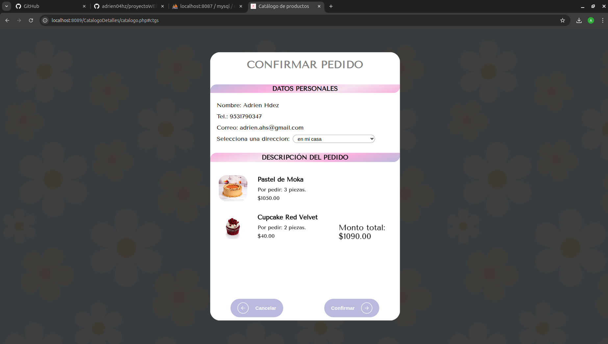

# SITIO WEB MOCHISIMO

Proyecto realizado el `17 de Febrero de 2025` para Ingeniería de Software en colaboración con https://github.com/Valm04, posteriormente a los pasos se encuentra la demostración.

Por otro lado, la página se encuentra en desarrollo.

Para poder inicializar su ejecución se necesitan los siguientes pasos:

1. Clonar el repositorio.

    ```bash
    git clone https://github.com/adrien04hz/sitio-web-mochisimo.git    
    ```

2. Dentro de la carpeta `/sitio-web-mochisimo`, crear las carpetas `/log`, `/data` y `/mysql_data` para poder ejecutar el contenedor con docker y no perder información.

3. Crear un archivo `.env` con las siguientes variables asignando el valor deseado.

    ```bash
    MYSQL_ROOT_PASSWORD=
    MYSQL_DATABASE=
    MYSQL_USER=
    MYSQL_PASSWORD=
    ```

4. Una vez teniendo el archivo `.env`, levantar los servicios del archivo `docker-compose.yml`.

    ```bash
    docker compose up -d
    ```

5. Con los servicios levantados, entrar al bash del contenedor de apache.

    ```bash
    docker exec -it apache_container2 bash
    ```

6. Dentro del bash, instalar los drivers para apache.

    ```bash
    docker-php-ext-install mysqli pdo pdo_mysql
    ```

    y salir del bash con `ctrl + d`.

7. Detener los servicios.

    ```bash
    docker compose stop
    ```

    y reiniciarlos

    ```bash
    docker compose up -d
    ```

La página estará corriendo en `localhost:8089`y el PhpMyAdmin en `localhost:8087`. Se incluye el archivo `my_database.sql` para rellenar la base de datos y poder ocupar la página, son datos de ejemplo.

# DEMOSTRACIÓN

Dentro de la página se pueden encontrar los siguientes apartados de manera general (Clic en la imagen para descargar el video de demostración, los videos se encuentran en la carpeta `/public/Video`).

### Cátalogo de productos
[](./public/Video/Catalogo_mochisimo.mp4)

### Carrito de compras
[](./public/Video/Carrito_mochisimo.mp4)

### Iniciar sesión y registrarse
[](./public/Video/log_sign_mochisimo.mp4)

### Realizar pedido
[](./public/Video/realizar_pedido.mp4)

### Pedidos de cliente
[](./public/Video/mis_pedidos.mp4)

### Blog y reseñas
[](./public/Video/rese_blog_mochisimo.mp4)

### Interfaz de Administrador
[](./public/Video/admin_mochisimo.mp4)
